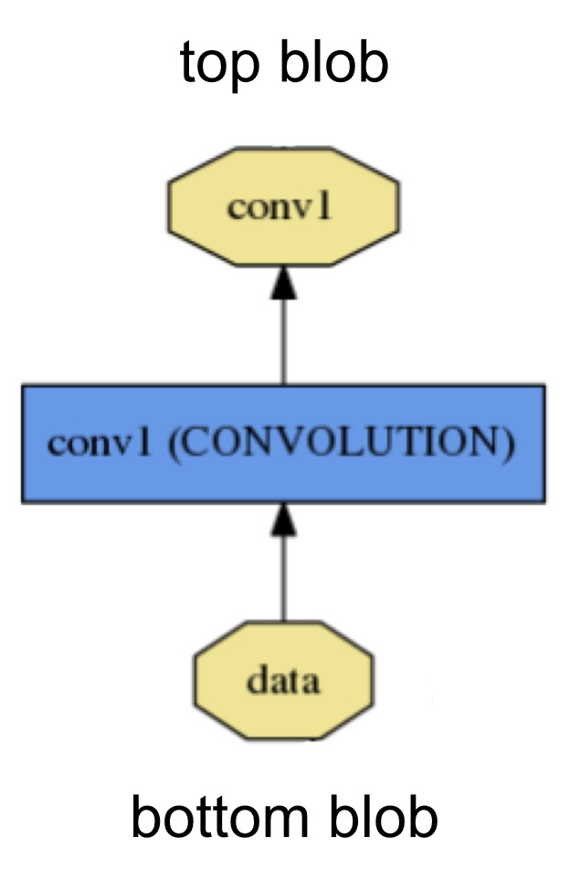
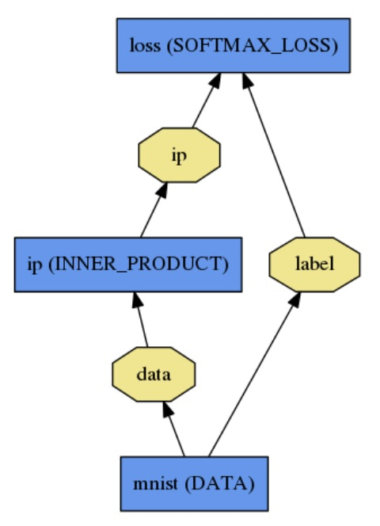

# 블롭, 레이어, 신경망: 카페 모델 해부 (Blobs, Layers, and Nets: anatomy of a Caffe model)

심층 신경망은 데이터 묶음을 다루는, 서로 연결되어 있는 레이어의 집합으로 표현되는 합성 모델입니다. 카페는 신경망을 레이어 하나하나마다 스스로의 모델 표현 방식으로 정의합니다. 신경망은 전체 모델을 입력값으로부터 손실(loss)까지 정의합니다. 데이터와 미분계수가 신경망을 따라서 앞으로 또 뒤로 흘러갈 때 카페는 정보를 블롭 (방울이라는 뜻) 형태를 사용해 저장하고 통신하고 따룹니다. 블롭은 이 프레임워크를 위한 표준 배열이며 통일된 메모리 인터페이스입니다. 모델과 계산을 설계하기 위해 다음으로 필요한 것은 레이어입니다. 신경망은 레이어의 모음, 그리고 레이어와 레이어 간의 연결의 모음입니다. 블롭에 대한 자세한 내용을 통해 정보가 레이어와 신경망에서 어떻게 저장되고 통신되는지 알 수 있습니다.
(Deep networks are compositional models that are naturally represented as a collection of inter-connected layers that work on chunks of data. Caffe defines a net layer-by-layer in its own model schema. The network defines the entire model bottom-to-top from input data to loss. As data and derivatives flow through the network in the forward and backward passes Caffe stores, communicates, and manipulates the information as _blobs_: the blob is the standard array and unified memory interface for the framework. The layer comes next as the foundation of both model and computation. The net follows as the collection and connection of layers. The details of blob describe how information is stored and communicated in and across layers and nets.)

문제를 푸는 방법(solving)은 모델링과 최적화를 분리하기 위해 따로 설정됩니다.
(Solving is configured separately to decouple modeling and optimization.)

이 각각의 요소를 더 자세히 설명하도록 하겠습니다.
(We will go over the details of these components in more detail.)

## 블롭 저장과 통신 (Blob storage and communication)

블롭은 카페가 가공하고 전달하는 실제 데이터에 대한 포장이고, 내부적으로는 CPU와 GPU간의 동기화 기능을 지원합니다. 수학적으로 보면 블롭은 C의 메모리 형식으로 저장된 N차원의 배열입니다.
(A Blob is a wrapper over the actual data being processed and passed along by Caffe, and also under the hood provides synchronization capability between the CPU and the GPU. Mathematically, a blob is an N-dimensional array stored in a C-contiguous fashion.)

카페는 블롭을 사용해서 데이터를 저장하고 통신합니다. 블롭은 데이터 저장에 대한 통일된 메모리 인터페이스를 제공합니다. 사진 묶음, 모델 인자, 최적화를 위한 미분계수 등이 그 예입니다.
(Caffe stores and communicates data using blobs. Blobs provide a unified memory interface holding data; e.g., batches of images, model parameters, and derivatives for optimization.)

블롭은 CPU/GPU 혼합 작업에 대한 계산 과부하와 정신력 과부하를 필요에 따라 CPU 호스트를 기준으로 GPU 기기들을 동기화함으로써 감춥니다. 호스트와 기기의 메모리는 효율적인 메모리 사용을 위해 필요에 따라 (느긋하게) 배정됩니다.
(Blobs conceal the computational and mental overhead of mixed CPU/GPU operation by synchronizing from the CPU host to the GPU device as needed. Memory on the host and device is allocated on demand (lazily) for efficient memory usage.)

이미지 데이터 일괄 작업(batch)을 위한 일반적인 블롭의 차원은 개수 N x 채널 K x 높이 H x 넓이 W입니다. 블롭의 메모리는 행(row) 기준으로 배치되어 있어서 마지막과 가장 오른쪽 차원의 변경이 쉽습니다. 예를 들어 4차원 블롭에서 인덱스 (n, k, h, w)의 값은 물리적으로 인덱스 ((n * K + k) * H + h) * W + w)에 존재합니다.
(The conventional blob dimensions for batches of image data are number N x channel K x height H x width W. Blob memory is row-major in layout, so the last / rightmost dimension changes fastest. For example, in a 4D blob, the value at index (n, k, h, w) is physically located at index ((n * K + k) * H + h) * W + w.)

* 숫자 N은 데이터의 일괄 묶음 크기입니다. 일괄 처리를 통해 통신과 장비 사용의 처리량이 늘어납니다. 256장의 사진을 일괄 처리하는 이미지넷(ImageNet) 학습의 경우 N = 256 입니다.
(Number / N is the batch size of the data. Batch processing achieves better throughput for communication and device processing. For an ImageNet training batch of 256 images N = 256.)

* 채널 K는 특징(feature)의 차원입니다. 예를 들어 RGB 사진의 경우 K = 3 입니다.
(Channel / K is the feature dimension e.g. for RGB images K = 3.)
 
카페 예제의 많은 블롭이 이미지 처리를 위한 축을 포함하는 4차원이지만, 블롭을 이미지 처리가 아닌 용도로 써도 당연히 괜찮습니다. 예를 들어 평범한 다중 레이어 퍼셉트론과 같은 가득 연결된 네트워크(fully-connected)가 필요하다면 2차원 블롭((N, D) 모양)을 사용하고 InnerProductLayer(나중에 설명할 것입니다)를 호출하면 됩니다.
(Note that although many blobs in Caffe examples are 4D with axes for image applications, it is totally valid to use blobs for non-image applications. For example, if you simply need fully-connected networks like the conventional multi-layer perceptron, use 2D blobs (shape (N, D)) and call the InnerProductLayer (which we will cover soon).)

블롭의 차원에 대한 인자는 레이어의 종류와 구성에 따라 달라집니다. 11 x 11의 공간 차원 필터 96개와 3개의 입력으로 이루어진 합성곱 신경망(convolutional network)의 경우 블롭은 96 x 3 x 11 x 11이 됩니다. 1000개의 출력 채널과 1024개의 입력 채널로 이루어진 가득 연결된 레이어(fully-connected layer)나 벡터 내적(inner product)의 경우 블롭의 인자는 1000 x 1024가 됩니다.
(Parameter blob dimensions vary according to the type and configuration of the layer. For a convolution layer with 96 filters of 11 x 11 spatial dimension and 3 inputs the blob is 96 x 3 x 11 x 11. For an inner product / fully-connected layer with 1000 output channels and 1024 input channels the parameter blob is 1000 x 1024.)

스스로의 데이터에 대해서는 어쩌면 스스로의 입력 가공 도구나 데이터 레이어를 만들어야 할 수도 있습니다. 하지만 어쨌든 데이터가 입력되면 할 일은 끝난 것입니다. 레이어의 모듈성(modularity)이 나머지 일을 대신 해 줍니다.
(For custom data it may be necessary to hack your own input preparation tool or data layer. However once your data is in your job is done. The modularity of layers accomplishes the rest of the work for you.)

### 구현 상세 내용 (Implementation Details)

우리가 종종 블롭의 벡터 기울기(gradient) 뿐만 아니라 블롭의 값에도 관심을 가지기 때문에 블롭은 _data_와 _diff_, 두 종류의 메모리 묶음을 저장합니다. 전자는 우리가 전달하는 일반 데이터이고 후자는 신경망이 계산한 벡터 기울기입니다.
(As we are often interested in the values as well as the gradients of the blob, a Blob stores two chunks of memories, _data_ and _diff_. The former is the normal data that we pass along, and the latter is the gradient computed by the network.)

더 나아가, 실제 값은 CPU나 GPU 어느 쪽에든 저장될 수 있기 때문에, 값에 접근하는 두 개의 서로 다른 방식이 존재합니다. 값을 바꾸지 않는 상수 방식(const way)과 값을 바꾸는 변수 방식(mutable way)입니다.
(Further, as the actual values could be stored either on the CPU and on the GPU, there are two different ways to access them: the const way, which does not change the values, and the mutable way, which changes the values:)

    const Dtype* cpu_data() const;
    Dtype* mutable_cpu_data();

(GPU와 벡터 기울기에 대해서도 비슷합니다.)
((similarly for gpu and diff).)

디자인을 이렇게 한 것은 동기와의 세부 내용을 감추고 데이터 교환을 최소화하기 위해 CPU와 GPU의 값을 동기화할 때에 블롭이 SyncedMem 클래스를 사용하기 때문입니다. 가장 우선되는 원칙은 값을 바꾸고 싶지 않을 경우에는 상수형 호출(const call)을 하며 절대로 여러분이 만든 객체에 포인터를 저장하지 말라는 것입니다. SyncedMem에게 언제 데이터를 복사할지 알려주기 위해서, 블롭 작업을 하면서 포인터를 써야 할 때에는 항상 함수를 사용해야 합니다.
(The reason for such design is that, a Blob uses a SyncedMem class to synchronize values between the CPU and GPU in order to hide the synchronization details and to minimize data transfer. A rule of thumb is, always use the const call if you do not want to change the values, and never store the pointers in your own object. Every time you work on a blob, call the functions to get the pointers, as the SyncedMem will need this to figure out when to copy data.)

실제 사용 환경에서 GPU가 있을 경우 데이터를 디스크에서 CPU 코드용 블롭으로 불러오고, 장비 커널(device kernel)을 호출해서 GPU 연산을 하고, 블롭을 다음 레이어로 보내고, 세부적인 내용은 신경쓰지 않은 채 고수준의 성능을 유지할 수 있습니다. 모든 레이어가 GPU를 구현해 놓았다면 모든 중간 단계 데이터와 벡터 기울기는 GPU 안에 머무르게 됩니다.
(In practice when GPUs are present, one loads data from the disk to a blob in CPU code, calls a device kernel to do GPU computation, and ferries the blob off to the next layer, ignoring low-level details while maintaining a high level of performance. As long as all layers have GPU implementations, all the intermediate data and gradients will remain in the GPU.)

블롭이 언제 데이터를 복사하는 지 알고 싶다면, 다음의 실제 예제를 보세요.
(If you want to check out when a Blob will copy data, here is an illustrative example:)

    // 데이터가 처음에는 CPU에 있다고 가정하고, 블롭(blob)도 이미 있다고 가정합니다.
    // Assuming that data are on the CPU initially, and we have a blob.
    const Dtype* foo;
    Dtype* bar;
    // 데이터를 CPU에서 GPU로 복사합니다.
    foo = blob.gpu_data(); // data copied cpu->gpu.
    // 양쪽 데이터가 최신이기 때문에 아무 데이터도 복사되지 않습니다.
    foo = blob.cpu_data(); // no data copied since both have up-to-date contents.
    // 아무 데이터도 복사되지 않습니다.
    bar = blob.mutable_gpu_data(); // no data copied.
    // ... 뭔가 작업을 합니다 ...
    // ... some operations ...
    // 아직 GPU를 사용하는 중이기 때문에 아무 데이터도 복사되지 않습니다.
    bar = blob.mutable_gpu_data(); // no data copied when we are still on GPU.
    // GPU에서 데이터가 수정되었기 때문에 GPU에서 CPU로 데이터가 복사됩니다.
    foo = blob.cpu_data(); // data copied gpu->cpu, since the gpu side has modified the data
    // 양쪽 데이터가 최신이기 때문에 아무 데이터도 복사되지 않습니다.
    foo = blob.gpu_data(); // no data copied since both have up-to-date contents
    // 여전히 아무 데이터도 복사되지 않습니다.
    bar = blob.mutable_cpu_data(); // still no data copied.
    // CPU에서 GPU로 데이터가 복사됩니다.
    bar = blob.mutable_gpu_data(); // data copied cpu->gpu.
    // GPU에서 CPU로 데이터가 복사됩니다.
    bar = blob.mutable_cpu_data(); // data copied gpu->cpu.

## 레이어 계산과 연결 (Layer computation and connections)

레이어는 모델의 핵심이고 계산의 필수 단위입니다. 레이어는 필터, 모으기(pool), 벡터 내적, 정류 선형(rectified-linear)이나 시그모이드 혹은 각각에 요소에 적용되는 다른 변환, 표준화(normalize), 데이터 불러오기 및 소프트맥스와 힌지(hinge) 손실 계산에 사용됩니다. 레이어 목록에 모든 작업이 설명되어 있습니다. 최신 심층 학습(deep learning)에 필요한 대부분의 작업이 포함되어 있습니다. 
(The layer is the essence of a model and the fundamental unit of computation. Layers convolve filters, pool, take inner products, apply nonlinearities like rectified-linear and sigmoid and other elementwise transformations, normalize, load data, and compute losses like softmax and hinge. See the layer catalogue for all operations. Most of the types needed for state-of-the-art deep learning tasks are there.)

레이어가 아래 연결에서 입력을 받아서 위 연결로 출력을 합니다.
(A layer takes input through bottom connections and makes output through top connections.)

각각의 레이어 종류는 설정(setup), 전진(forward), 후진(backward), 세 가지 필수적인 연산을 정의합니다.
(Each layer type defines three critical computations: setup, forward, and backward.)

* 설정: 모델 초기화 시 한 번 레이어와 그에 따른 연결을 초기화합니다.
(Setup: initialize the layer and its connections once at model initialization.)

* 전진: 아래에서 입력을 받아서 계산 결과를 위로 출력합니다.
(Forward: given input from bottom compute the output and send to the top.)

* 후진: 위의 출력에 대한 기울기가 주어졌을 때에 입력에 대한 기울기를 계산해서 밑으로 보냅니다. 인자(parameter)가 있는 레이어는 각 인자에 대한 기울기를 계산해서 내부에 저장해 놓습니다.
(Backward: given the gradient w.r.t. the top output compute the gradient w.r.t. to the input and send to the bottom. A layer with parameters computes the gradient w.r.t. to its parameters and stores it internally.)

더 자세히 말하자면, CPU와 GPU를 위해 전진과 후진 함수가 각각 두 개씩 구현됩니다. 만약 당신이 GPU용 함수를 구현하지 않으면 레이어는 예비용으로 CPU용 함수를 사용합니다. 이렇게 하면 빨리 실험을 해 볼 때에는 편리하겠지만 데이터 전송에 추가 자원이 필요하게 됩니다. (입력 값이 GPU에서 CPU로 복사되고, 출력 값이 다시 CPU에서 GPU로 복사됩니다.)
(More specifically, there will be two Forward and Backward functions implemented, one for CPU and one for GPU. If you do not implement a GPU version, the layer will fall back to the CPU functions as a backup option. This may come handy if you would like to do quick experiments, although it may come with additional data transfer cost (its inputs will be copied from GPU to CPU, and its outputs will be copied back from CPU to GPU).)

레이어는 신경망 전체에 대한 두 가지 중요한 책임을 지고 있는데, 입력을 받아서 출력을 내어 놓는 전진과 출력에 대한 기울기를 전달하는 후진, 그리고 전 단계에 있는 레이어로 역방향 전달되는 (back-propagated) 인자와 입력에 대한 기울기 계산이 그것입니다. 이 작업들은 단순히 각 레이어의 전진과 후진의 합성입니다.
(Layers have two key responsibilities for the operation of the network as a whole: a forward pass that takes the inputs and produces the outputs, and a backward pass that takes the gradient with respect to the output, and computes the gradients with respect to the parameters and to the inputs, which are in turn back-propagated to earlier layers. These passes are simply the composition of each layer’s forward and backward.)

신경망의 합성 성질과 코드의 단위성(modularity) 덕분에 개인이 레이어를 만드는 경우 최소한의 노력만 들이면 됩니다. 설정, 그리고 레이어의 전진과 후진만 정의하면 신경망에 포함될 준비가 다 끝납니다.
(Developing custom layers requires minimal effort by the compositionality of the network and modularity of the code. Define the setup, forward, and backward for the layer and it is ready for inclusion in a net.)

## 신경망의 정의와 연산 (Net definition and operation)

신경망은 함수와 함수의 기울기를 공동으로 합성(composition)과 자동 미분을 통해 정의합니다. 모든 레이어의 출력은 합성되어 주어진 작업에 대한 함수를 계산하게 되고, 모든 레이어의 후진은 합성되어 학습에 사용할 손실 값으로부터 기울기를 계산하게 됩니다. 카페 모델은 끝에서 끝을 아우르는 기계 학습 엔진입니다.
(The net jointly defines a function and its gradient by composition and auto-differentiation. The composition of every layer’s output computes the function to do a given task, and the composition of every layer’s backward computes the gradient from the loss to learn the task. Caffe models are end-to-end machine learning engines.)

신경망은 계산 그래프, 정확히는 방향성 비순환 그래프(DAG: Directed Acyclic Graph) 안에서 연결된 레이어의 집합입니다. 카페는 방향성 비순환 그래프의 레이어가 필요로 하는 모든 정보를 자동으로 기록해서 전진과 후진이 제대로 이루어졌는지를 확인합니다. 일반적인 신경망은 디스크에서 자료를 불러오는 데이터 레이어로 시작하여 분류(classification) 혹은 복원(reconstruction) 등과 같은 작업의 목표를 계산하는 손실 레이어로 끝납니다.
(The net is a set of layers connected in a computation graph – a directed acyclic graph (DAG) to be exact. Caffe does all the bookkeeping for any DAG of layers to ensure correctness of the forward and backward passes. A typical net begins with a data layer that loads from disk and ends with a loss layer that computes the objective for a task such as classification or reconstruction.)

신경망은 평범한 문자열로 된 모델링 언어로 작성된 여러 레이어와 그들간의 연결의 집합으로 정의됩니다. 단순한 로지스틱 회귀 분류는
(The net is defined as a set of layers and their connections in a plaintext modeling language. A simple logistic regression classifier)

다음과 같이 정의됩니다.
(is defined by)

    name: "LogReg"
    layer {
      name: "mnist"
      type: "Data"
      top: "data"
      top: "label"
      data_param {
        source: "input_leveldb"
        batch_size: 64
      }
    }
    layer {
      name: "ip"
      type: "InnerProduct"
      bottom: "data"
      top: "ip"
      inner_product_param {
        num_output: 2
      }
    }
    layer {
      name: "loss"
      type: "SoftmaxWithLoss"
      bottom: "ip"
      bottom: "label"
      top: "loss"
    }

(Model initialization is handled by `Net::Init()`. The initialization mainly does two things: scaffolding the overall DAG by creating the blobs and layers (for C++ geeks: the network will retain ownership of the blobs and layers during its lifetime), and calls the layers’ `SetUp()` function. It also does a set of other bookkeeping things, such as validating the correctness of the overall network architecture. Also, during initialization the Net explains its initialization by logging to INFO as it goes:)

    I0902 22:52:17.931977 2079114000 net.cpp:39] Initializing net from parameters:
    name: "LogReg"
    [...model prototxt printout...]
    # construct the network layer-by-layer
    I0902 22:52:17.932152 2079114000 net.cpp:67] Creating Layer mnist
    I0902 22:52:17.932165 2079114000 net.cpp:356] mnist -> data
    I0902 22:52:17.932188 2079114000 net.cpp:356] mnist -> label
    I0902 22:52:17.932200 2079114000 net.cpp:96] Setting up mnist
    I0902 22:52:17.935807 2079114000 data_layer.cpp:135] Opening leveldb input_leveldb
    I0902 22:52:17.937155 2079114000 data_layer.cpp:195] output data size: 64,1,28,28
    I0902 22:52:17.938570 2079114000 net.cpp:103] Top shape: 64 1 28 28 (50176)
    I0902 22:52:17.938593 2079114000 net.cpp:103] Top shape: 64 (64)
    I0902 22:52:17.938611 2079114000 net.cpp:67] Creating Layer ip
    I0902 22:52:17.938617 2079114000 net.cpp:394] ip <- data
    I0902 22:52:17.939177 2079114000 net.cpp:356] ip -> ip
    I0902 22:52:17.939196 2079114000 net.cpp:96] Setting up ip
    I0902 22:52:17.940289 2079114000 net.cpp:103] Top shape: 64 2 (128)
    I0902 22:52:17.941270 2079114000 net.cpp:67] Creating Layer loss
    I0902 22:52:17.941305 2079114000 net.cpp:394] loss <- ip
    I0902 22:52:17.941314 2079114000 net.cpp:394] loss <- label
    I0902 22:52:17.941323 2079114000 net.cpp:356] loss -> loss
    # set up the loss and configure the backward pass
    I0902 22:52:17.941328 2079114000 net.cpp:96] Setting up loss
    I0902 22:52:17.941328 2079114000 net.cpp:103] Top shape: (1)
    I0902 22:52:17.941329 2079114000 net.cpp:109]     with loss weight 1
    I0902 22:52:17.941779 2079114000 net.cpp:170] loss needs backward computation.
    I0902 22:52:17.941787 2079114000 net.cpp:170] ip needs backward computation.
    I0902 22:52:17.941794 2079114000 net.cpp:172] mnist does not need backward computation.
    # determine outputs
    I0902 22:52:17.941800 2079114000 net.cpp:208] This network produces output loss
    # finish initialization and report memory usage
    I0902 22:52:17.941810 2079114000 net.cpp:467] Collecting Learning Rate and Weight Decay.
    I0902 22:52:17.941818 2079114000 net.cpp:219] Network initialization done.
    I0902 22:52:17.941824 2079114000 net.cpp:220] Memory required for data: 201476

(Note that the construction of the network is device agnostic - recall our earlier explanation that blobs and layers hide implementation details from the model definition. After construction, the network is run on either CPU or GPU by setting a single switch defined in `Caffe::mode()` and set by `Caffe::set_mode()`. Layers come with corresponding CPU and GPU routines that produce identical results (up to numerical errors, and with tests to guard it). The CPU / GPU switch is seamless and independent of the model definition. For research and deployment alike it is best to divide model and implementation.)

### 모델 형식 (Model format)

(The models are defined in plaintext protocol buffer schema (prototxt) while the learned models are serialized as binary protocol buffer (binaryproto) .caffemodel files.)

(The model format is defined by the protobuf schema in caffe.proto. The source file is mostly self-explanatory so one is encouraged to check it out.)

(Caffe speaks Google Protocol Buffer for the following strengths: minimal-size binary strings when serialized, efficient serialization, a human-readable text format compatible with the binary version, and efficient interface implementations in multiple languages, most notably C++ and Python. This all contributes to the flexibility and extensibility of modeling in Caffe.)
